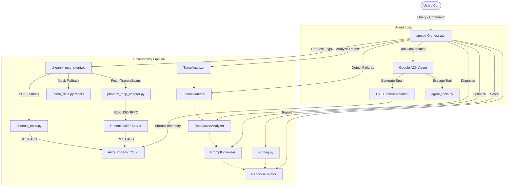
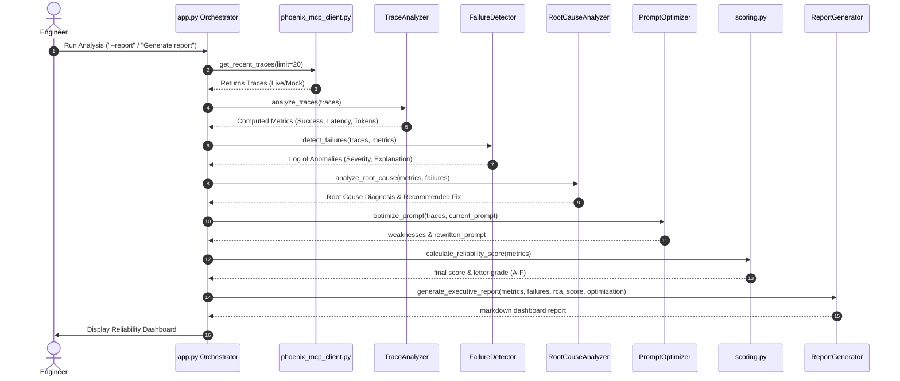

# Architecture & Data Flow — PhoenixGuard

This document details the system architecture and sequence flows of **PhoenixGuard**, highlighting the integration of **Google ADK**, **Gemini 2.5 Flash**, and **Arize Phoenix**.

## System Architecture

---

## Component Interactions

1. **Google ADK Agent (`app.py`)**:
   Runs the main agent loop. Wrapped in `google-adk`'s `Runner` with an `InMemorySessionService`. It executes general tools (`get_weather`, `get_system_health`) and self-introspection tools (`get_phoenix_traces`, etc.).
   
2. **OpenTelemetry Instrumentation**:
   `GoogleADKInstrumentor` listens to all agent and LLM spans and routes them to Arize Phoenix Cloud using `register(project_name="phoenixguard")`.

3. **Phoenix MCP Client (`phoenix_mcp_client.py`) & Adapter (`phoenix_mcp_adapter.py`)**:
   Acts as the central API gateway. It auto-detects connectivity and connects to Phoenix Cloud via the **official Arize Phoenix MCP Server** using Stdio transport. If the MCP server is not available, it falls back to the **Phoenix Python SDK REST Client (`PhoenixTools`)**, and then to local high-fidelity mock data if offline.

4. **Orchestrator Pipeline**:
   Coordinates the analysis flow:
   * **TraceAnalyzer** parses traces and computes latency, token, and success averages.
   * **FailureDetector** evaluates rules (latency > 5s, tool crashes, tokens > 8k) and calls Gemini to identify pattern errors.
   * **RootCauseAnalyzer** correlates metrics to diagnose root causes and recommend fixes.
   * **PromptOptimizer** suggestions prompt changes based on errors.
   * **Scorer** aggregates components into a weighted score (40% Success, 20% Latency, 20% Tool Quality, 20% Error Rate) and letter grade (A–F).
   * **ReportGenerator** compiles the dashboard Markdown report.

---

## Data Flow Sequence

